## Background and Disclaimer

This post (unfortunately) has nothing to do with the X-Files 1998 movie "Fight the Future" but I couldn't resist using the title.  
 
Facebook created a forecasting package for R and Python called Prophet. I've seen quite a few tutorials and examples for Prophet in Python but not many for R. Documentation can be found [here](https://facebook.github.io/prophet/) for both languages. 

From the description: 

"Prophet is a procedure for forecasting time series data based on an additive model where non-linear trends are fit with yearly, weekly, and daily seasonality, plus holiday effects. It works best with time series that have strong seasonal effects and several seasons of historical data. Prophet is robust to missing data and shifts in the trend, and typically handles outliers well."

Disclaimer: This blog post is NOT intended as investment advice. The charts and analyses contained within this post are provided to illustrate the functions of the prophet package and to share my personal opinions on stocks.

## Getting Data

First, using the package BatchGetSymbols to get the stocks I'm interested in. 


```r
stocks <- BatchGetSymbols(
  c("BB", "CLX",
    "UAVS", "TLRY",
    "ENG", "SPCE", "MNMD"),
  first.date = today() %m-% years(4),
  last.date = today(),
  thresh.bad.data = .1
)$df.tickers

stocks <- stocks %>% clean_names()
```


## Forecasting with prophet

For the forecasting exercise, I'm going to start with BB. I'm interested to see what the prophet model will do with sudden price increases, and BB seemed like the more reasonable way to test this, as opposed to GME where we have a $300+ increase. The tidyquant package has a geom_candlestick chart function for ggplot, which is what I'm using here. 

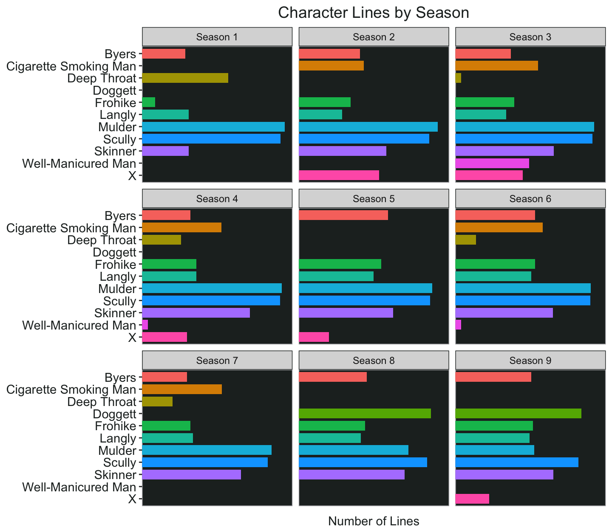

### Getting Started

Steps: 

1. Select a ticker from the batch symbols dataframe and rename the columns to correspond to prophet's expected inputs (ds and y).
2. Get a dataframe of U.S. holidays using prophet's built-in holiday dataset.
3. Create a training dataset to fit the model using historical data, and a test dataset of more recent data to test the results.
3. Fit the prophet model to the training dataset 
4. Make a future dataframe for the prediction and exclude weekends (Saturday is day 7 and Sunday is day 1 using wday from lubridate)
5. Use generic R "predict" function to predict the closing price 

Note: both the prophet and predict functions might take a minute to run, this depends partly on your computer and partly on the amount of data you're using to create the models. On my Windows laptop that I used to use for work, this would take quite a while. With my new M1 Macbook Pro it only takes a few seconds. 


```r
data("generated_holidays")

generated_holidays <- generated_holidays %>% 
  filter(country == "US")
```


```r
df_train <- stocks %>%
  filter(ticker == "BB", ref_date < "2021-03-01") %>%
  select("ds" = ref_date, "y" = price_close)

df_test <- stocks %>%
  filter(ticker == "BB", ref_date >= "2021-03-01") %>%
  select("ds" = ref_date, "y" = price_close)

m <- prophet(holidays = generated_holidays)
m <- fit.prophet(m, df_train)

future <- make_future_dataframe(m, periods = 120)

future <- future %>%
  mutate(week_day = wday(ds)) %>%
  filter(between(week_day, 2, 6))

forecast <- predict(m, future)

test <- plot(m, forecast)
```

### Initial Results 

Now I can plot the result. The blue line represents the predicted values, and the light blue shaded areas represent the uncertainty of the predicted model. The pink dots represent the actual closing price of the stock. 

Note that it doesn't come close to predicting $25 back in January (and I didn't expect it to). 


```r
test +
  labs(title = "BB Prophet Model", 
       subtitle = "120-Day Prediction",
       y = "Closing Price", x = "") +
  my_theme
```

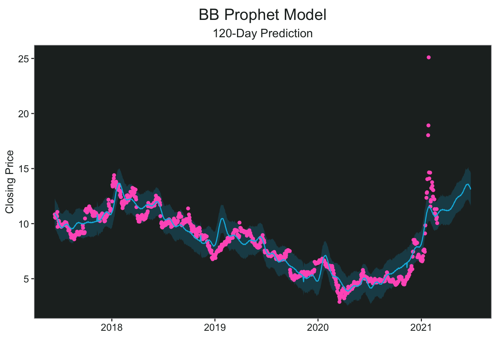
  
  
### Training vs. Test Data 

Now using the training dataset which includes the most recent data (March 2021-current), I can compare the model's prediction to the actual price movement (represented by the purple dots).


```r
forecast %>%
  ggplot(aes(x = as.Date(ds), y = yhat)) +
  geom_line(col = pal.9[6], size = 1.1) +
  geom_point(data = df_train, aes(x = ds, y = y), col = pal.9[9]) +
  geom_point(data = df_test, aes(x = ds, y = y), col = pal.9[8]) +
  labs(
    title = "BB Prophet Model vs. Test Data",
    subtitle = "120 Day Prediction",
    y = "Closing Price",
    x = ""
  ) +
  my_theme
```

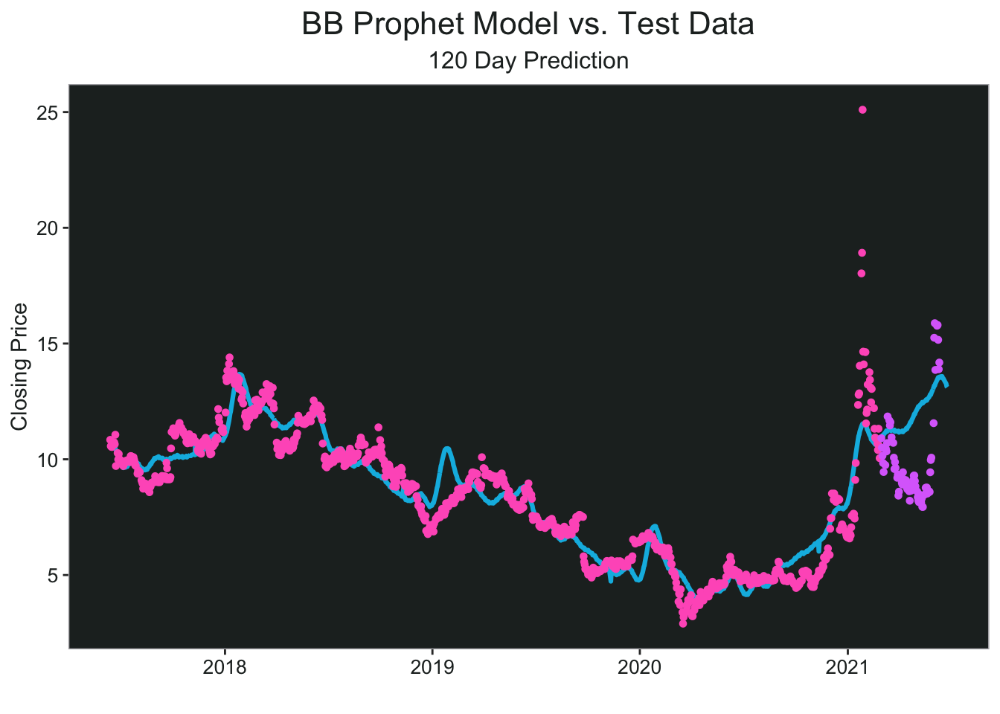
  
  
### Increasing Model Flexibility

It looks like I need to increase the flexibility of the forecast, and maybe that would help me get a higher prediction in both January and June (closer to the actual price). I think this result is quite interesting. It predicted the second increase almost exactly, but it still doesn't account for the large dip before the stock shot up to $15 again. Historically though, it predicted downtrends just fine. 


```r
m2 <- prophet(df_train, changepoint.prior.scale = 0.5, holidays = generated_holidays)
forecast2 <- predict(m2, future)
```

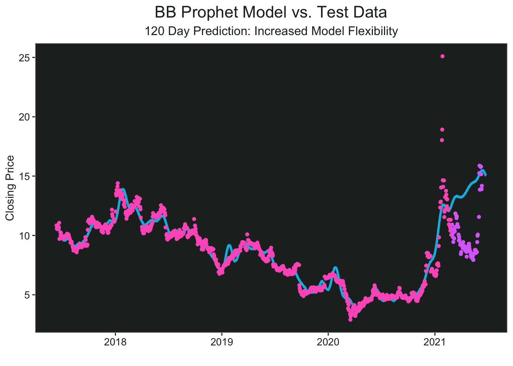
  
## One Year Prediction 

Now that I know it (kind of) works, I will predict for the next year, keeping the increase in model flexibility as seen in the last chart. Note that increasing the flexibility also means increasing uncertainty, and I'm not sure how that will play out on a longer time frame. 


```r
df <- stocks %>% 
  filter(ticker == "BB") %>% 
  select("ds" = ref_date, "y" = price_close)

m3 <- prophet(df, changepoint.prior.scale = 0.5, holidays = generated_holidays)

future3 <- make_future_dataframe(m3, periods = 365)

future3 <- future3 %>% 
  mutate(week_day = wday(ds)) %>% 
  filter(between(week_day, 2,6))

forecast3 <- predict(m3, future3)

test2 <- plot(m3, forecast3)
```

Very interesting, with the longer timeframe for future prediction it looks like increasing the flexibility of the model is not that helpful. For one thing it doesn't predict the current price as accurately as the previous (shorter) prediction. It also increases the uncertainty to the point where the prediction isn't really useful. It's like saying "by this time next year, the closing price of BB will be between -$10 and $50". 


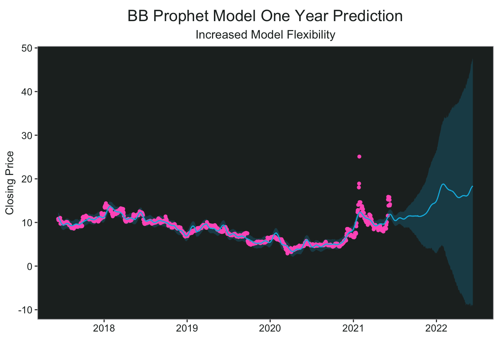

### Decrease Model Flexibility

What would it look like if I went back to the default flexibility? The resulting prediction still has BB trading around $20 per share, but the uncertainty is much lower, and there's a pretty clear uptrend. 


```r
m4 <- prophet(df, holidays = generated_holidays)

forecast4 <- predict(m4, future3)

test3 <- plot(m4, forecast4)
```

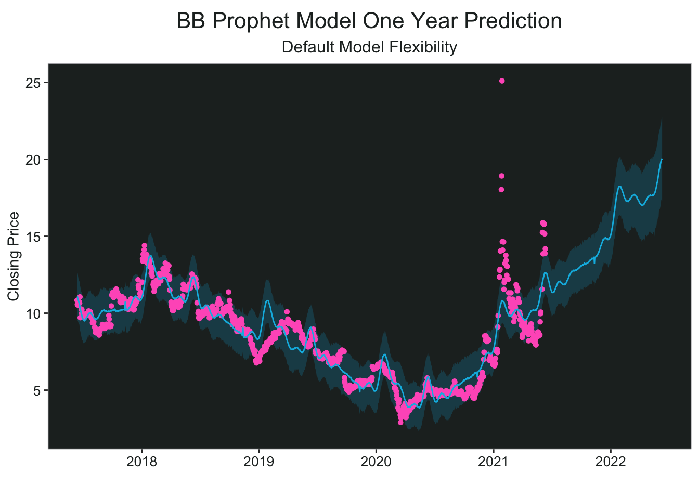

### Adding Google Trend Data

I wondered if there was something else I could do to increase the accuracy of the predictive model. I noticed in the [prophet documentation](https://facebook.github.io/prophet/docs/seasonality,_holiday_effects,_and_regressors.html#additional-regressors) that you can use additional regressors in the model. The first thing I thought of was to mine the wallstreetbets reddit data and do a text analysis of sentiment over time. But I don't really have time right now, so I decided to use some Google trend data on hits using BB as the keyword. 

Steps: 

1. Get the Google trend data, specifying the keyword and date range. Other information is available, but I'm only asking it for interest over time. 
2. Create a new column with the logarithmic scale for hits and a floor date for weeks - since this is weekly data I have to have a way to join it consistently with the stock dataframe. 
3. Add the Google trend data to the stock dataframe and future dataframe.
4. Add as a regressor and fit the prophet model 

At this point, I realized that I had NAs in my Google trend data because (duh) they can't magically provide future trend data. I wondered if it was still worth using, but I decided to test it out anyways. All I did was replace the NAs for the future data with the average hits of the prior data. 

5. Run the forecast and plot the model.


```r
google_trend <- gtrends(
  keyword = "BB",
  geo = "US",
  onlyInterest = TRUE,
  time = "2017-06-11 2021-06-11"
)$interest_over_time

google_trend <- google_trend %>%
  mutate(log_hits = log(hits)) %>%
  mutate(date2 = floor_date(date, "weeks"))

df <- df %>%
  mutate(date2 = floor_date(ds, unit = "weeks")) %>%
  left_join(google_trend %>% select(date2, hits, log_hits))

future3 <- future3 %>%
  mutate(date2 = floor_date(ds, "weeks")) %>%
  left_join(google_trend %>% select(date2, hits, log_hits))

m5 <- prophet(holidays = generated_holidays)

m5 <- add_regressor(m5, "hits")

m5 <- fit.prophet(m5, df)

future3 <- future3 %>% 
  mutate(hits = replace_na(hits, 28),
         log_hits = log(hits))

forecast5 <- predict(m5, future3)

test5 <- plot(m5, forecast5)
```

The results are actually pretty cool, it seems that even though we don't have magic future trend data, using the past trend data was enough to improve the model. 

- The new model correctly predicted the huge price increases.
- It accurately predicted the decrease in price after the first spike, whereas the previous models did not.
- We have a more reasonable price prediction for the near future, and potentially a more accurate prediction for the next year. 
- Uncertainty increases after January 2022, but it is still much better than the first one-year prediction with the increased flexibility.

The green line below the chart is just the log scale of the Google trend data so you can see how that played out especially during the price increases.  

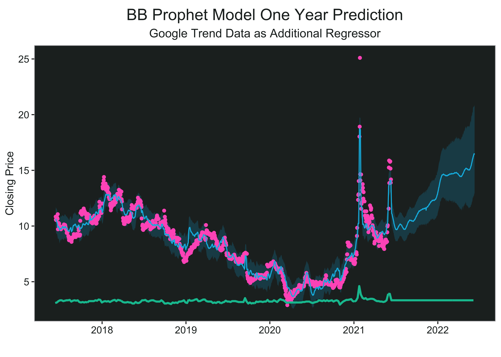


## My Picks Week of June 14th 2021

My current positions are: 

- MNMD (shares)
- TLRY (shares)
- SPCE (puts)

With ggplot line charts and using facet_wrap, I can easily compare the price action between different tickers. Here is the closing price of each stock for the past calendar year for the six with the most historical data. I'm mostly focusing on the first four.   


```r
stocks %>%
  filter(ref_date >= "2020-06-13",
         ticker %in% c("CLX", "UAVS", "SPCE",
                       "MNMD", "TLRY", "ENG")) %>%
  ggplot(aes(
    x = ref_date,
    y = price_close,
    group = ticker,
    color = ticker
  )) +
  geom_line() +
  labs(title = "Daily Chart",
       y = "Closing Price", x = "") +
  scale_x_date(date_labels = "%m-%y",
               limits = c(today() %m-% years(1), today() %m+% months(1))) +
  facet_wrap(~ ticker, ncol = 2, scale = "free_y") +
  my_theme
```

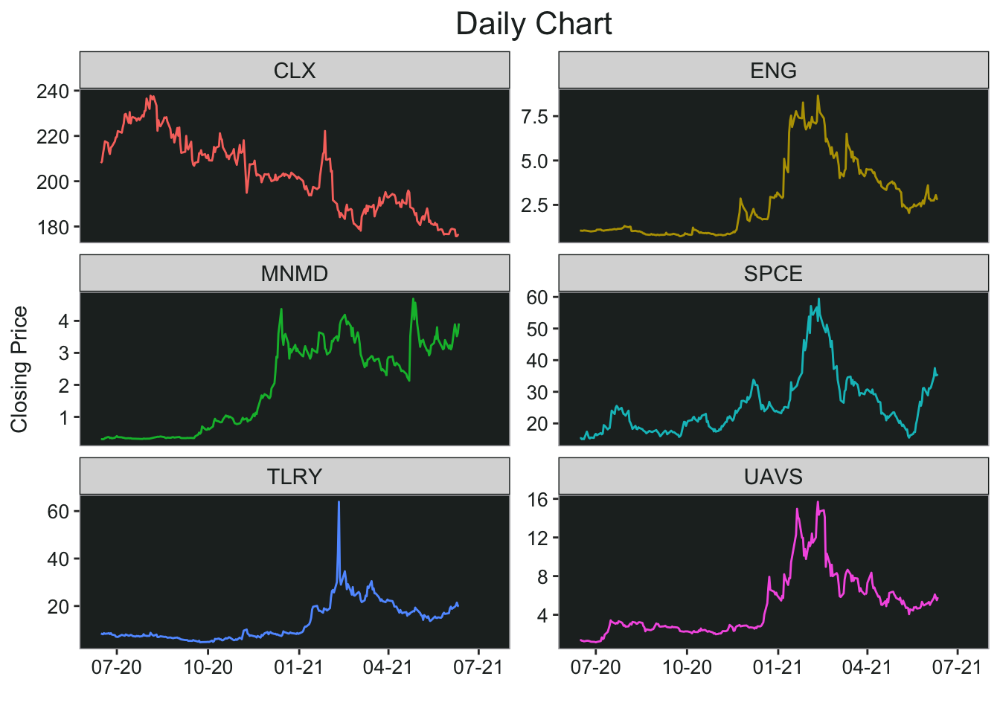

### CLX 

I picked this ticker because: 

1. Household goods sector seasonality comes into play during the summer months
2. It's been on a downtrend for quite a while and the chart looks ready to break out
3. Calls are cheap 

It might not be the best prediction chart, but the charts are not the only basis for this pick. I'm planning on entering early this coming week. 

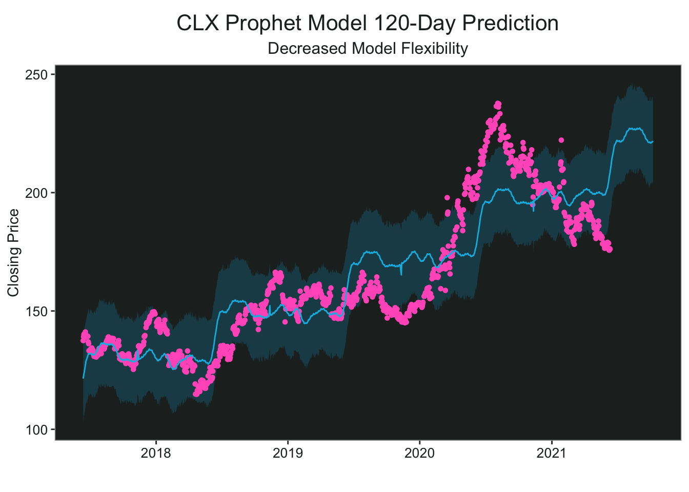

### ENG

I traded this before and sold at the peak, I think it has another run coming. If it can get above $3 and hold I will take a call position. 


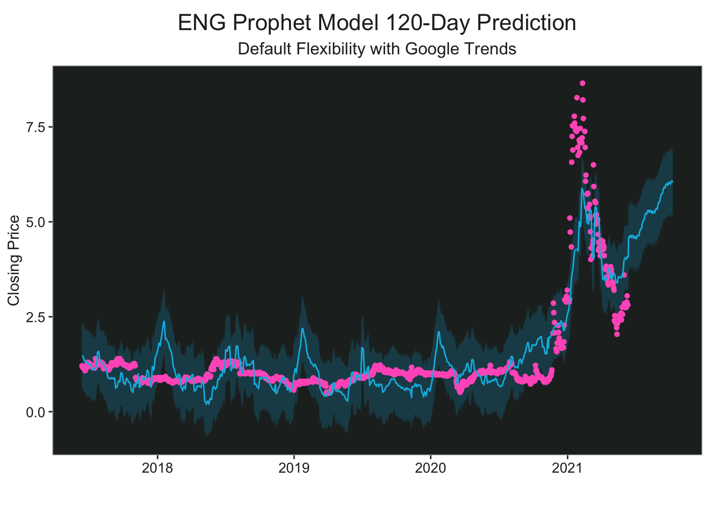

### MNMD


Mindmed benefitted from the Google trend data, but I didn't plot it because it was very messy looking. I'm bullish on this ticker and sector overall for similar reasons as the cannabis stocks. 

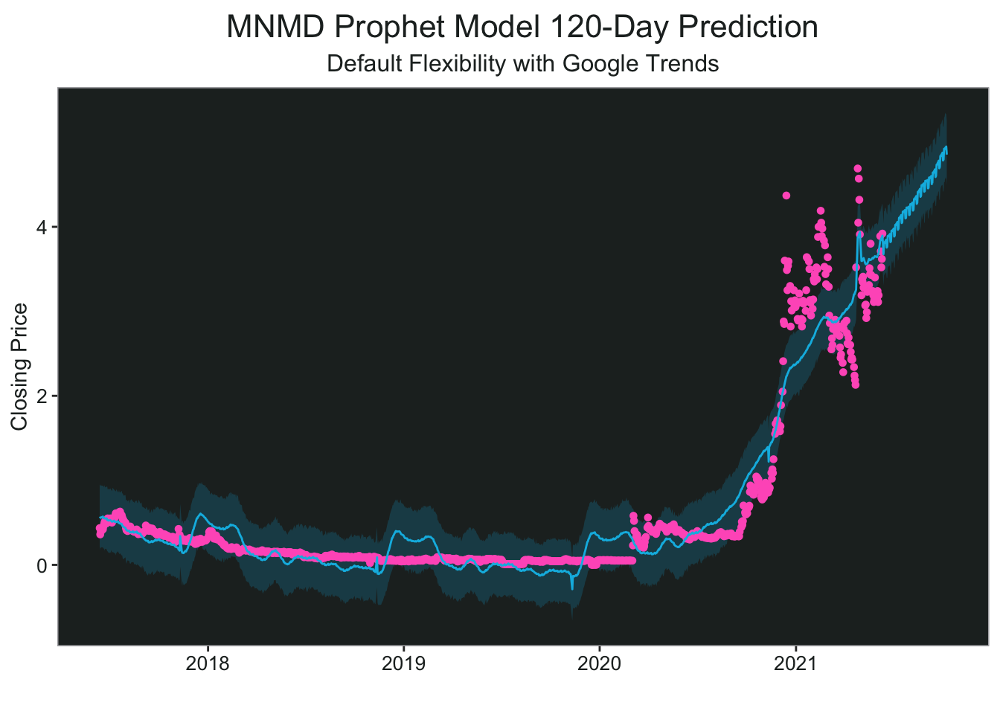

### SPCE


I like SPCE overall, but I think it's due for a pretty sharp drop before the next leg up, which is why I have short term puts.  

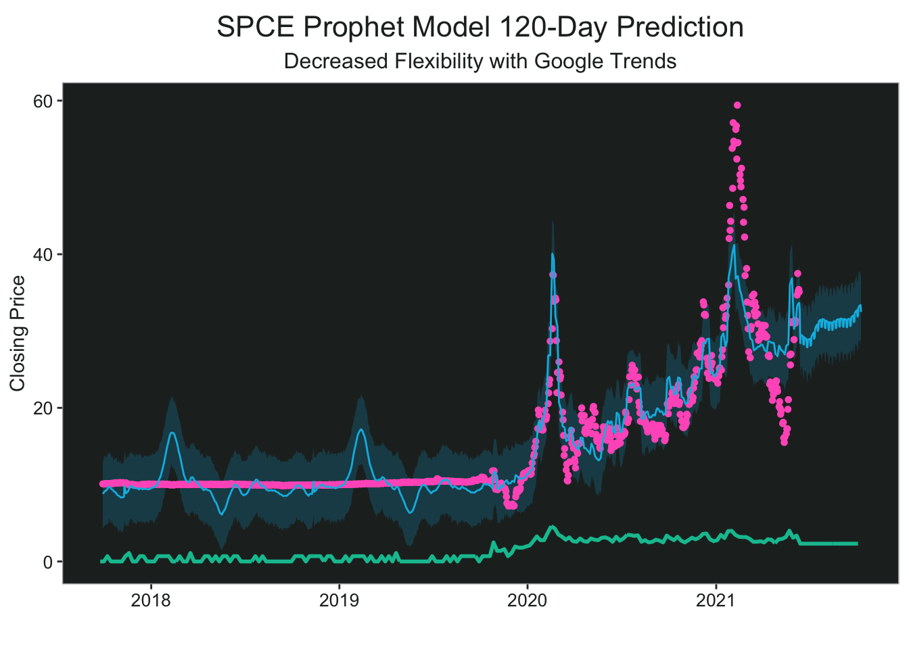


### TLRY


TLRY was another case where the Google trend data improved the model quite a bit (not all of them were useful). I didn't include the Google trend line because it was too messy with the actual numbers and not super useful on the log scale. 

Tilray is more of a long-term swing for me, I bought some shares when it was around $17 recently to sell covered calls. Very bullish on this in the near future, and the whole sector really. 

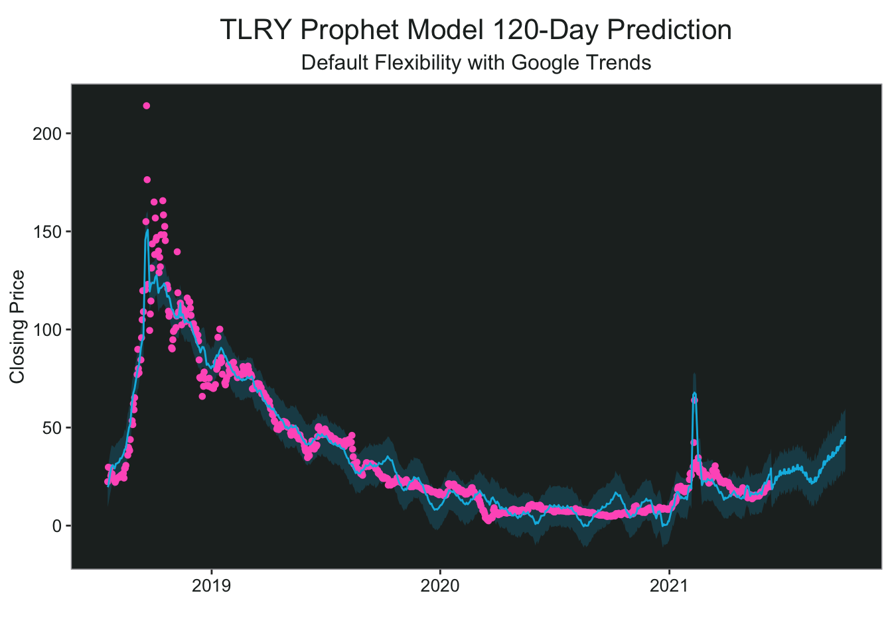
  
  
### UAVS

UAVS is a drone play and I really like the chart setup here. With the historical data it just looks like a giant cup and handle. Drones were also featured in ARK's [Big Ideas 2021](https://ark-invest.com/big-ideas-2021/).


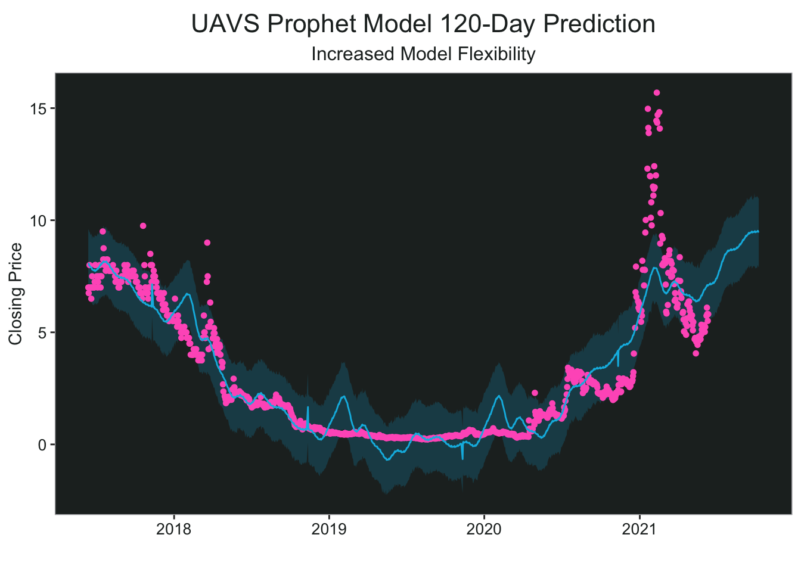

And that's all for today. Maybe I'll check back in a year and see what actually happened. In the meantime, I'll be busy researching - and hopefully making money.

