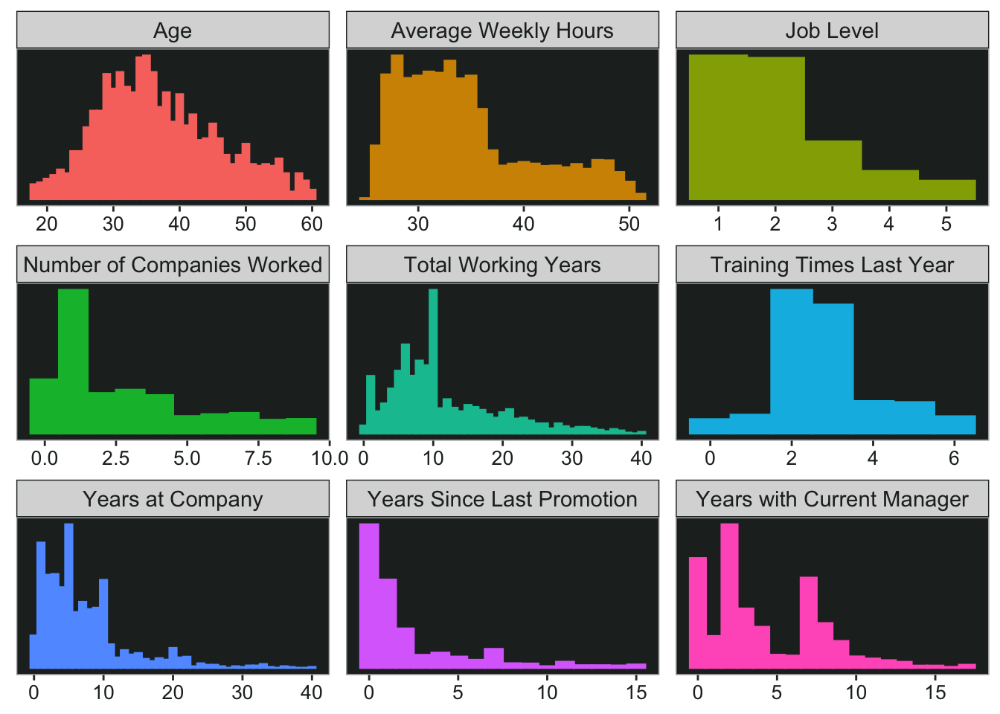
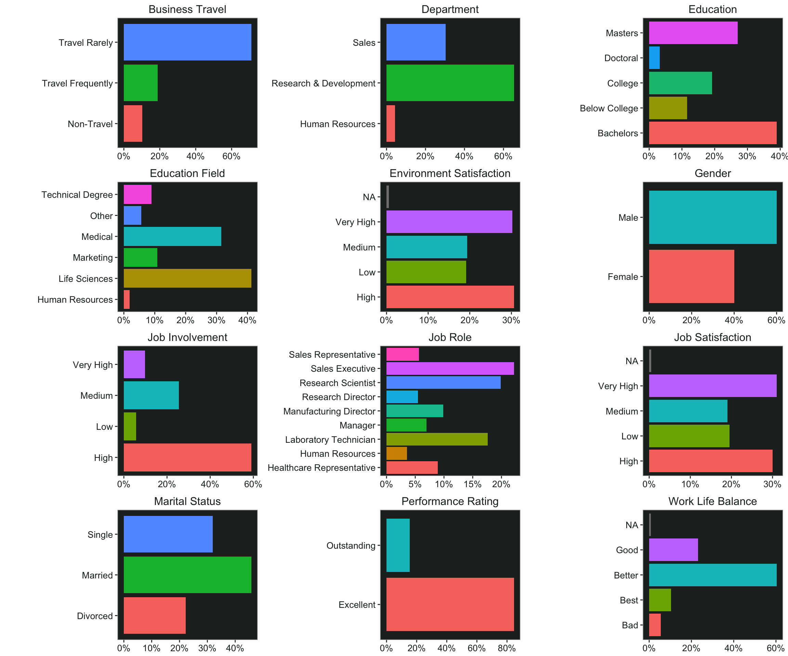
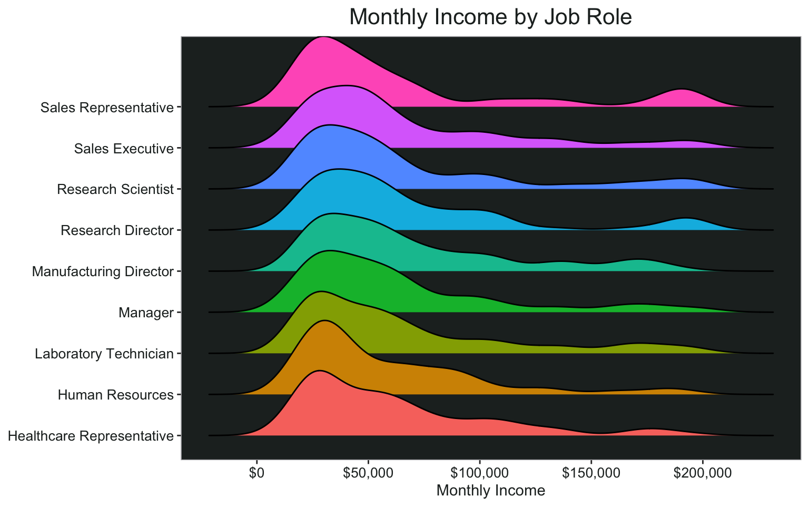
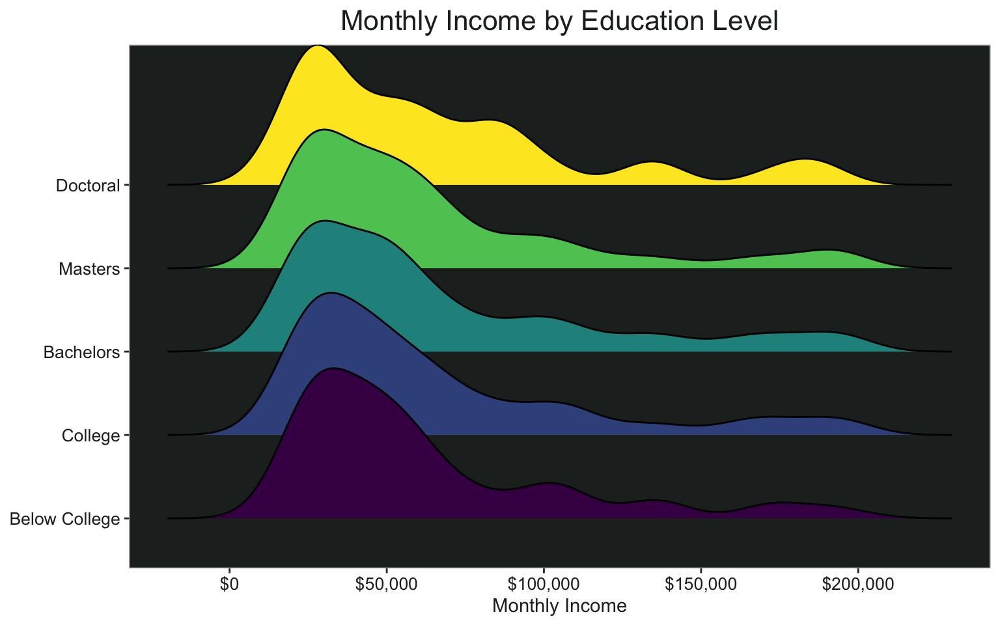
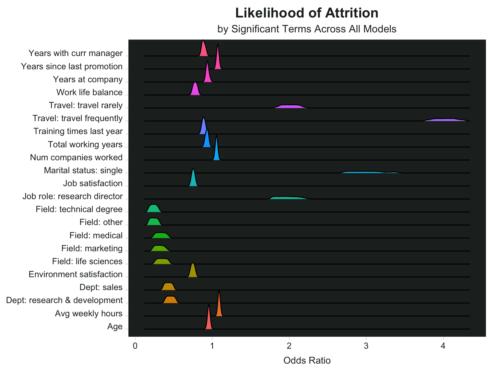
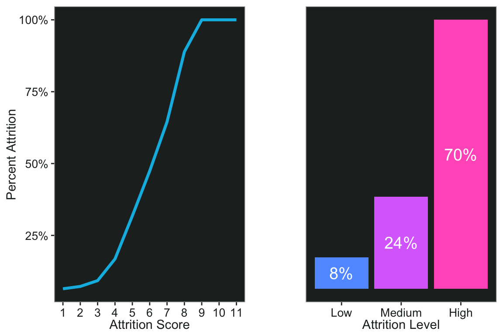

# Background

This post is partially inspired by one of my favorite blogs ever, [Ask a Manager](https://www.askamanager.org). I am obsessed with this content - partly because Alison (the writer) is super smart and gives good advice, partly for the pure entertainment value. I'll be linking to some great posts along the way, but in the meantime here is a [list of Alison's favorite posts ever](https://www.askamanager.org/favorite-posts).

In the past whenever I needed to create a predictive model, I was always frustrated because I wanted to know what the best model would be given all possible combinations of variables. But you wouldn't want to test all combinations of all variables, because some of them are too similar and would over-inflate the model. For example, I wouldn't use a variable like "age at event x" and another variable "age over 18 at event x" in one model.

A few weeks ago I was taking an online Python course and the course was covering truth tables, which look like this: 


| A | B | A or B |
|:-:|:-:|:------:|
| T | T |   T    |
| T | F |   T    |
| F | T |   T    |
| F | F |   F    |

In order for the third column (A or B) to be true, either A or B, or both A and B need to be true. 

I realized I needed to do was figure out how to recreate a truth table where each column represents a group of potential variables for the model. This post is based on a real project, but I needed some publicly-available data to demonstrate with. I know there is a heart disease that is often used for prediction, but that's kind of...boring. Also there weren't that many variables. 

Then I came across this HR employee attrition dataset on [Kaggle](https://www.kaggle.com/vjchoudhary7/hr-analytics-case-study?select=general_data.csv) and thought that might be more interesting, given some of the crazy stories I've read on Ask a Manager over the years that often resulted in people leaving,, sometimes in rather [spectacular fashion](https://www.askamanager.org/2017/10/resigning-via-cod-a-glorious-out-of-office-message-and-other-quitting-stories.html). 

In this post I'll cover a little bit of data import and cleaning, visualization, and finally how to create a *bunch* of models at once. I've loaded the following packages: 

- tidyverse
- lubridate
- janitor
- knitr
- ggplot2
- readxl
- ggridges
- broom
- glue

# Data Import

I downloaded the csv files from  [Kaggle](https://www.kaggle.com/vjchoudhary7/hr-analytics-case-study?select=general_data.csv) and created an R Project in the same folder. 

- Get list of csv files
- Use purrr::map to read csv into a list of tibbles
- Name the tibbles in the list (this is why I put "full.names = TRUE")
- Map over the tibbles with janitor's clean_names function to make the column names all lower case separated by underscores.


```r
temp.list <- list.files(full.names = TRUE, pattern = "*.csv", path = "~/Desktop/Rproj/")

data_list <- map(temp.list, read_csv)

names(data_list) <- word(temp.list, -2, sep = "/|\\.csv")

data_list <- data_list %>% 
  map( ~.x %>% clean_names)
```


I have a list of five tibbles, two of which are timestamp datasets and not in tidy format yet. 


```r
summary(data_list)
```

```
##                      Length Class       Mode
## employee_survey_data   4    spec_tbl_df list
## general_data          24    spec_tbl_df list
## in_time              262    spec_tbl_df list
## manager_survey_data    3    spec_tbl_df list
## out_time             262    spec_tbl_df list
```

## General Data

We have a general dataset, a manager survey, and an employee survey. These three tables can be joined on employee ID.

Side note: If you are a manager, try not to force your employees to [complete a daily mental health survey](https://www.askamanager.org/2020/07/my-manager-makes-us-do-mental-health-surveys-every-day.html), it's not a great look and [they'll probably all quit](https://www.askamanager.org/2020/12/update-my-manager-makes-us-do-mental-health-surveys-every-day.html). 


```r
data <- data_list$general_data %>%
  left_join(data_list$employee_survey_data) %>%
  left_join(data_list$manager_survey_data) %>%
  select(employee_id, everything())
```

## Time Data

This is what the time data looks like currently. Notice each column is a date, except for the first one which corresponds to the employee ID. This is exactly what tidyr is for. 


```r
head(data_list$in_time)[1:6] %>% 
  kable()
```


| x1|x2015_01_01 |x2015_01_02         |x2015_01_05         |x2015_01_06         |x2015_01_07         |
|--:|:-----------|:-------------------|:-------------------|:-------------------|:-------------------|
|  1|NA          |2015-01-02 09:43:45 |2015-01-05 10:08:48 |2015-01-06 09:54:26 |2015-01-07 09:34:31 |
|  2|NA          |2015-01-02 10:15:44 |2015-01-05 10:21:05 |NA                  |2015-01-07 09:45:17 |
|  3|NA          |2015-01-02 10:17:41 |2015-01-05 09:50:50 |2015-01-06 10:14:13 |2015-01-07 09:47:27 |
|  4|NA          |2015-01-02 10:05:06 |2015-01-05 09:56:32 |2015-01-06 10:11:07 |2015-01-07 09:37:30 |
|  5|NA          |2015-01-02 10:28:17 |2015-01-05 09:49:58 |2015-01-06 09:45:28 |2015-01-07 09:49:37 |
|  6|NA          |2015-01-02 09:43:08 |2015-01-05 10:14:00 |2015-01-06 10:08:42 |2015-01-07 10:18:15 |

Using pivot_longer, I can preserve the employee ID in one column, put the date in another column, and the timestamp in a third column. I usually use lubridate to format dates, in this case I also had to get rid of the "x" at the beginning of the character because otherwise it would be NA. I'm also going to add the timestamps for clocking out. 


```r
time_data <- data_list$in_time %>%
  pivot_longer(!x1, names_to = "date", values_to = "time_in") %>%
  mutate(date = ymd(str_remove_all(date, "x"))) %>%
  left_join(
    data_list$out_time %>%
      pivot_longer(!x1, names_to = "date", values_to = "time_out") %>%
      mutate(date = ymd(str_remove_all(date, "x")))
  ) %>% 
  rename("employee_id" = x1)
```

Create some additional variables for aggregation later. This would be especially useful for any [nosy coworkers](https://www.askamanager.org/2015/01/my-coworker-is-trying-to-track-my-hours-and-pto.html) who might want to [track your hours](https://www.askamanager.org/2014/09/my-coworker-is-tracking-my-hours.html). 

- Number of hours worked each day
- Week column 


```r
time_data <- time_data %>% 
  mutate(hours = round(time_length(time_in %--% time_out, "hour"), 2)) %>% 
  mutate(hours = replace_na(hours, 0)) %>% 
  mutate(week = week(date))
```

Much better

```r
head(time_data) %>% 
  kable()
```


| employee_id|date       |time_in             |time_out            | hours| week|
|-----------:|:----------|:-------------------|:-------------------|-----:|----:|
|           1|2015-01-01 |NA                  |NA                  |  0.00|    1|
|           1|2015-01-02 |2015-01-02 09:43:45 |2015-01-02 16:56:15 |  7.21|    1|
|           1|2015-01-05 |2015-01-05 10:08:48 |2015-01-05 17:20:11 |  7.19|    1|
|           1|2015-01-06 |2015-01-06 09:54:26 |2015-01-06 17:19:05 |  7.41|    1|
|           1|2015-01-07 |2015-01-07 09:34:31 |2015-01-07 16:34:55 |  7.01|    1|
|           1|2015-01-08 |2015-01-08 09:51:09 |2015-01-08 17:08:32 |  7.29|    2|

# Data Cleaning

Using the data dictionary Excel file provided from Kaggle, I'm recoding some of the numeric variables as factors for better visualization in charts. Also create a numeric variable for attrition (to be used later in modeling).


```r
data <- data %>%
  mutate(education_2 = factor(
    education,
    labels = c("Below College", "College", "Bachelors", "Masters", "Doctoral"),
    ordered = TRUE
  )) %>%
  mutate(across(
    one_of(
      "environment_satisfaction",
      "job_involvement",
      "job_satisfaction"
    ),
    list("2" = ~ factor(
      ., labels = c("Low", "Medium", "High", "Very High"),
      ordered = TRUE
    ))
  )) %>%
  mutate(performance_rating_2 = factor(performance_rating, 
                                       labels = c("Excellent", "Outstanding"),
                                       ordered = TRUE)) %>%
  mutate(work_life_balance_2 = factor(work_life_balance, 
                                      labels = c("Bad", "Good", "Better", "Best"),
                                      ordered = TRUE)) %>% 
  mutate(business_travel = str_replace_all(business_travel, "_", " ")) %>% 
  mutate(attrition_2 = ifelse(attrition == "Yes", 1, 0))
```

Aggregate the timestamp data down to average hours worked per week and add to the dataset. 


```r
data <- time_data %>% 
  group_by(employee_id, week) %>% 
  summarise(week_hours = sum(hours)) %>% 
  group_by(employee_id) %>% 
  summarise(avg_weekly_hours = round(mean(week_hours, na.rm=TRUE))) %>% 
  right_join(data)
```

# Data Viz 

Checking out some of the numeric variables, I can plot multiple histograms using ggplot and facet_wrap. And here are some fun Ask a Manager posts to go along with them:

- A reader's direct report is [obsessed with her age](https://www.askamanager.org/2016/04/my-older-employee-has-an-issue-with-my-age.html)
- What to do when [you're working crazy hours and your boss reprimands you for coming in late](https://www.askamanager.org/2019/08/my-boss-lectured-me-about-arriving-on-time-when-im-working-a-ton-of-hours.html)
- If you're an entry level employee, maybe think twice before [giving your manager "constructive" feedback](https://www.askamanager.org/2018/10/my-entry-level-employee-gave-me-a-bunch-of-off-base-constructive-criticism.html)


```r
data %>% 
  select("Age" = age, 
         "Average Weekly Hours" = avg_weekly_hours, 
         "Job Level" = job_level,
         "Number of Companies Worked" = num_companies_worked, 
         "Total Working Years" = total_working_years, 
         "Training Times Last Year" = training_times_last_year, 
         "Years at Company" = years_at_company,
         "Years Since Last Promotion" = years_since_last_promotion,
         "Years with Current Manager" = years_with_curr_manager) %>% 
  gather(item, number) %>% 
  ggplot(aes(number, color = item, fill = item))+
  geom_histogram(binwidth = 1)+
  facet_wrap(~item, scales = "free")+
  my_theme +
  theme(legend.position = "none",
        axis.text.y = element_blank(),
        axis.title.y = element_blank(),
        axis.title.x = element_blank(),
        axis.ticks.y = element_blank())
```



## Bar Charts
For the categorical variables it's not quite as easy to plot multiple charts at once. But I can start by nesting the data. This gives me a list of dataframes - one for every item I want to plot. 

```r
plot_data <- data %>% 
  select("Gender" = gender,
         "Marital Status" = marital_status,
         "Business Travel" = business_travel,
         "Work Life Balance" = work_life_balance_2,
         
         "Education" = education_2,
         "Education Field" = education_field,
         "Department" = department,
         "Job Role" = job_role,
         
         "Environment Satisfaction" = environment_satisfaction_2,
         "Job Involvement" = job_involvement_2,
         "Job Satisfaction" = job_satisfaction_2,
         "Performance Rating" = performance_rating_2
         ) %>% 
  gather(item, thing) %>% 
  count(item, thing) %>% 
  group_by(item) %>% 
  mutate(pct = n/sum(n)) %>% 
  group_nest(data = item)

print(head(plot_data))
```

```
## # A tibble: 6 x 2
##   item                                   data
##   <chr>                    <list<tibble[,3]>>
## 1 Business Travel                     [3 × 3]
## 2 Department                          [3 × 3]
## 3 Education                           [5 × 3]
## 4 Education Field                     [6 × 3]
## 5 Environment Satisfaction            [5 × 3]
## 6 Gender                              [2 × 3]
```


Now I can use map to iterate over the dataframes with my ggplot code. I'm actually using map2 here so that I can use the "item" column as titles for the charts (pasted in using glue). Now I have the plots in a new column and I can print them out. 

```r
plot_data <- plot_data %>%
  mutate(
    plot = map2(
      data,
      item,
      ~ ggplot(data = .x, aes(
        x = pct, y = thing, fill = thing
      )) +
        ggtitle(glue("{.y}")) +
        geom_col() +
        scale_x_continuous(labels = scales::percent_format(accuracy = 1)) +
        my_theme +
        theme(axis.title.y = element_blank(),
              axis.title.x = element_blank(),
              plot.title = element_text(size = 12))
    )
  )

print(head(plot_data))
```

```
## # A tibble: 6 x 3
##   item                                   data plot  
##   <chr>                    <list<tibble[,3]>> <list>
## 1 Business Travel                     [3 × 3] <gg>  
## 2 Department                          [3 × 3] <gg>  
## 3 Education                           [5 × 3] <gg>  
## 4 Education Field                     [6 × 3] <gg>  
## 5 Environment Satisfaction            [5 × 3] <gg>  
## 6 Gender                              [2 × 3] <gg>
```

I'm using ggarrange so that I can lay them out in a grid and make them the same size using horizontal + vertical alignment. Thankfully ggarrange already has a plotlist argument, so I don't have to write out every plot in the list separately.

Note: If you don't want NAs in your charts, you can replace them using fct_explicit_na from the forcats package. 

Speaking of variables, here are some more related posts from Ask a Manager: 

- If your company has a [leadership training program for women](https://www.askamanager.org/2021/06/my-companys-leadership-programs-for-women-excludes-men.html), try not to be a jerk about it
- Speaking of marital status, what happens when your [dad is dating your boss and they want you to go to couples therapy with them](https://www.askamanager.org/2018/05/my-dad-is-dating-my-boss-and-they-want-me-to-go-to-couples-therapy-with-them.html)?


```r
ggpubr::ggarrange(
  plotlist = plot_data$plot,
  nrow = 4,
  ncol = 3,
  align = 'hv'
)
```



## Ridgeline Charts

I would like to visualize how some of the variables interact with each other. Ridgeline charts can be a good way to do that, and they look pretty cool. 


```r
ggplot(data, aes(x = monthly_income, y= job_role, fill = job_role))+
  geom_density_ridges()+
  scale_x_continuous(name = "Monthly Income", labels = scales::dollar)+
  ggtitle("Monthly Income by Job Role")+
  my_theme+
  theme(axis.title.y = element_blank())
```



By level of education: 


```r
ggplot(data, aes(x = monthly_income, y= education_2, fill = education_2))+
  geom_density_ridges()+
  scale_x_continuous(name = "Monthly Income", labels = scales::dollar)+
  ggtitle("Monthly Income by Education Level")+
  my_theme+
  theme(axis.title.y = element_blank())
```



# Creating the Models

Now that I've cleaned up and explored the data a little bit, it's time to start the modeling process. 

### Creating Variable Groups

To create my "truth table" for all possible combinations of variables to model, I need to group my variables into categories. Some of these probably could be grouped in different ways, but this is just for demonstration purposes so it doesn't have to be perfect. I'm wrapping all the groups in the crossing() function from tidyr, which will expand these lists to all possible combinations of the different variable groups.  


```r
cross_df <- crossing(
    age = c("age", "total_working_years", "num_companies_worked"),
    demos = c("gender", "marital_status"),
    company_time = c(
      "years_at_company",
      "years_since_last_promotion",
      "years_with_curr_manager"
    ),
    work_life_balance = c(
      "distance_from_home",
      "business_travel",
      "work_life_balance",
      "avg_weekly_hours"
    ),
    level = c(
      "education",
      "job_level",
      "monthly_income",
      "stock_option_level"
    ),
    work_type = c("education_field", "department", "job_role"),
    performance = c(
      "performance_rating",
      "training_times_last_year",
      "percent_salary_hike"
    ),
    satisfaction = c("environment_satisfaction", "job_satisfaction")
  )
```

This is what the resulting tibble looks like. There are 5,184 different possible model combinations. 


```r
print(head(cross_df))
```

```
## # A tibble: 6 x 8
##   age   demos  company_time   work_life_balance level  work_type performance    
##   <chr> <chr>  <chr>          <chr>             <chr>  <chr>     <chr>          
## 1 age   gender years_at_comp… avg_weekly_hours  educa… departme… percent_salary…
## 2 age   gender years_at_comp… avg_weekly_hours  educa… departme… percent_salary…
## 3 age   gender years_at_comp… avg_weekly_hours  educa… departme… performance_ra…
## 4 age   gender years_at_comp… avg_weekly_hours  educa… departme… performance_ra…
## 5 age   gender years_at_comp… avg_weekly_hours  educa… departme… training_times…
## 6 age   gender years_at_comp… avg_weekly_hours  educa… departme… training_times…
## # … with 1 more variable: satisfaction <chr>
```
### Creating Formulas

Now I have variables I need for the model but they're all in different columns. I need to make it look more like the formula I'm going to use. To do that, I can use unite (also from tidyr). I'll combine columns 1 through 8 into a new column called "formula", separated by the plus sign because that's the syntax the model will need as an input. 

Then I paste the outcome variable (attrition_2) in front of the formula, just like it would be in a glm model. Add a model name to help keep track of everything later on.


```r
formula_df <- cross_df %>% 
  unite(formula, c(1:8), sep = "+") %>% 
  select(formula) %>% 
  mutate(formula = paste0("attrition_2 ~ ", formula)) %>% 
  mutate(model_name = row_number())
```

This is what the formula looks like

```r
print(head(formula_df))
```

```
## # A tibble: 6 x 2
##   formula                                                             model_name
##   <chr>                                                                    <int>
## 1 attrition_2 ~ age+gender+years_at_company+avg_weekly_hours+educati…          1
## 2 attrition_2 ~ age+gender+years_at_company+avg_weekly_hours+educati…          2
## 3 attrition_2 ~ age+gender+years_at_company+avg_weekly_hours+educati…          3
## 4 attrition_2 ~ age+gender+years_at_company+avg_weekly_hours+educati…          4
## 5 attrition_2 ~ age+gender+years_at_company+avg_weekly_hours+educati…          5
## 6 attrition_2 ~ age+gender+years_at_company+avg_weekly_hours+educati…          6
```

First I will create a function that I can map over my dataset of formulas. This is just a regular binomial logistic regression model. 


```r
mod_fun <- function(x) {glm(formula = as.formula(x), family = binomial("logit"), data = data)}
```


### Mapping the Models

Now map over the models. WARNING - this will take a minute. It's a bit faster if you don't ask for the odds ratios (exponentiated coefficients). If you have a very large dataset, you're going to want to test this on just a couple of your formulas to make sure you've got everything set up right. If you have a really, really large dataset, you can always run it in batches as well. What this does is: 

- Map over each cell in the formula column using the formula I created 
- Using the broom package, create a new tidied column for the model summary and model fit
- Unnest the model summary and fit info into a tidied dataframe


```r
model_df <- formula_df %>% 
  mutate(models = map(formula, mod_fun), 
         model_summary = models %>% map(~tidy(., exponentiate = TRUE)), 
         model_fit = models %>% map(glance)) %>%
  select(model_name, model_summary, model_fit) %>%
  unnest(c(model_summary, model_fit)) %>%
  mutate_if(is.numeric, ~ round(., 3))
```


## Filtering Model Data

Now I have a tidy dataset of all the models of all possible combinations of variables in my pre-defined groups. I can filter based on whatever criteria is most important. 


### Lowest AIC
For example, here is the model with the lowest AIC: 


```r
model_df %>% 
  filter(AIC == min(AIC)) %>% 
  head() %>% 
  print()
```

```
## # A tibble: 6 x 14
##   model_name term     estimate std.error statistic p.value null.deviance df.null
##        <dbl> <chr>       <dbl>     <dbl>     <dbl>   <dbl>         <dbl>   <dbl>
## 1       4925 (Interc…    0.113     0.397     -5.50   0             3861.    4375
## 2       4925 total_w…    0.948     0.008     -6.88   0             3861.    4375
## 3       4925 marital…    1.32      0.133      2.10   0.036         3861.    4375
## 4       4925 marital…    3.13      0.131      8.69   0             3861.    4375
## 5       4925 years_w…    0.914     0.016     -5.50   0             3861.    4375
## 6       4925 avg_wee…    1.09      0.007     13.1    0             3861.    4375
## # … with 6 more variables: logLik <dbl>, AIC <dbl>, BIC <dbl>, deviance <dbl>,
## #   df.residual <dbl>, nobs <dbl>
```

### All Significant Variables
Or I could look for models where every variable is statistically significant, or filter to ensure that the model contains one variable I'm particularly interested in. 


```r
model_df %>% 
  group_by(model_name) %>% 
  filter(all(p.value < .1), any(term == "age")) %>% 
  head() %>% 
  print()
```

```
## # A tibble: 6 x 14
## # Groups:   model_name [1]
##   model_name term     estimate std.error statistic p.value null.deviance df.null
##        <dbl> <chr>       <dbl>     <dbl>     <dbl>   <dbl>         <dbl>   <dbl>
## 1        869 (Interc…    0.231     0.406     -3.61   0             3870.    4384
## 2        869 age         0.961     0.005     -7.34   0             3870.    4384
## 3        869 marital…    1.28      0.132      1.85   0.065         3870.    4384
## 4        869 marital…    2.96      0.131      8.33   0             3870.    4384
## 5        869 years_a…    0.947     0.01      -5.56   0             3870.    4384
## 6        869 avg_wee…    1.09      0.007     13.3    0             3870.    4384
## # … with 6 more variables: logLik <dbl>, AIC <dbl>, BIC <dbl>, deviance <dbl>,
## #   df.residual <dbl>, nobs <dbl>
```

### Significance of Terms Across Models

I could look at how many times a particular term was considered significant across all models. It looks like environment satisfaction, job satisfaction, marital status, age,department, and education field are all near the top of the list. However, stock option level, gender, and a few of the job roles were not significant in many of the models (if at all).


```r
model_df %>% 
  group_by(term) %>% 
  summarise(num_significant = sum(p.value < .05)) %>% 
  arrange(desc(num_significant)) %>% 
  kable()
```


|term                             | num_significant|
|:--------------------------------|---------------:|
|(Intercept)                      |            3394|
|environment_satisfaction         |            2592|
|job_satisfaction                 |            2592|
|marital_statusSingle             |            2592|
|age                              |            1728|
|departmentResearch & Development |            1728|
|departmentSales                  |            1728|
|education_fieldLife Sciences     |            1728|
|education_fieldMarketing         |            1728|
|education_fieldMedical           |            1728|
|education_fieldOther             |            1728|
|education_fieldTechnical Degree  |            1728|
|total_working_years              |            1728|
|training_times_last_year         |            1728|
|years_with_curr_manager          |            1728|
|years_at_company                 |            1691|
|job_roleResearch Director        |            1598|
|avg_weekly_hours                 |            1296|
|business_travelTravel Frequently |            1296|
|business_travelTravel Rarely     |            1296|
|work_life_balance                |            1296|
|num_companies_worked             |            1193|
|marital_statusMarried            |            1039|
|percent_salary_hike              |             676|
|years_since_last_promotion       |             610|
|monthly_income                   |             481|
|performance_rating               |             130|
|job_roleResearch Scientist       |              97|
|job_roleManufacturing Director   |              88|
|education                        |              15|
|job_roleSales Executive          |               8|
|job_level                        |               5|
|distance_from_home               |               0|
|genderMale                       |               0|
|job_roleHuman Resources          |               0|
|job_roleLaboratory Technician    |               0|
|job_roleManager                  |               0|
|job_roleSales Representative     |               0|
|stock_option_level               |               0|


### Odds Ratios of Significant Terms Across Models

I can also look at the statistically significant terms to see how their odds ratios differ across the models. 


```r
plot2 <- model_df %>% 
  filter(!str_detect(term, "Intercept"), p.value < .01) %>% 
  count(term, estimate) %>% 
  mutate(term = str_to_sentence(str_replace_all(term, "_", " "))) %>% 
  filter(estimate != 0, !str_detect(term, "income")) %>% 
  mutate(term = str_replace_all(term, "Marital status", "Marital status: "),
         term = str_replace_all(term, "Job role", "Job role: "),
         term = str_replace_all(term, "Education field", "Field: "),
         term = str_replace_all(term, "Department", "Dept: "),
         term = str_replace_all(term, "Business travel", "Travel: "))

ggplot(plot2, aes(x = estimate, y = term, fill = term)) +
  geom_density_ridges(scale = 2
) +
  theme_ridges() + 
  scale_x_continuous(name = "Odds Ratio")+
  theme(legend.position = "none")+
  ggtitle("Likelihood of Attrition", subtitle = "by Significant Terms Across All Models")+
  my_theme+
  theme(axis.title.y = element_blank(),
        axis.title.x = element_text(family = "Arial", hjust = .5))
```



It looks like people who travel frequently have some of the highest odds ratios, which means they are more likely to leave their jobs. People who travel rarely are also likely to leave - in comparison to those who don't travel at all. Single people and research directors also have high likelihoods of leaving. These four variables also seem to vary the most in terms of the odds ratio across all models. For example the lowest odds ratio for marital status: single was around 2.6 and the highest was around 3.4. 

Average weekly hours, number of companies worked for, and years since last promotion all had a slightly higher likelihood of leaving, and their odds ratios were quite similar across all models. The lowest odds ratio for average weekly hours was 1.08, and the highest was 1.096. 

Some variables are associated with lower likelihood of leaving, for example age (older) and years at the company, some education fields and job roles. 

### Selecting a Final Model

I could use the information in the previous chart to filter down and select a final model. For example, I might want to ensure that the travel variable is included, along with marital status. And make sure they are both significant in whatever models I bring up. This set of filtering criteria gives me 648 models to choose from.

Speaking of marital status, there are so many good spouse-related posts. 

- A [job candidate's suspicious husband](https://www.askamanager.org/2020/08/job-candidates-suspicious-husband-photographed-me-before-her-interview.html) photographs her interviewer
- When you [accidentally start dating your new boss's husband](https://www.askamanager.org/2019/11/ive-been-accidentally-dating-my-bosss-husband.html)

And speaking of travel, this is one of my favorite posts ever - this poor woman got in trouble for what she was wearing [when her boss made her pick him up in the middle of the night](https://www.askamanager.org/2016/11/im-in-trouble-for-what-i-wore-when-when-my-boss-made-me-pick-him-up-for-the-airport-in-the-middle-of-the-night.html). Just... wtf?


```r
temp_models <- model_df %>% 
  group_by(model_name) %>% 
  filter(any(str_detect(term, "travel") & p.value < .05), any(str_detect(term, "marital") & p.value < .05))

distinct(temp_models, model_name) %>% nrow()
```

```
## [1] 648
```

That's still probably too many, so I'll add a filter for education field as well, since there are several fields that are less likely to leave. Now there are "only" 216 models. 


```r
temp_models <- temp_models %>% 
  group_by(model_name) %>% 
  filter(any(str_detect(term, "field") & p.value < .05))

distinct(temp_models, model_name) %>% nrow()
```

```
## [1] 216
```

You know what they say, people don't quit a job they quit a boss. Especially if they have one of the [worst bosses of 2020](https://www.askamanager.org/2020/12/the-worst-boss-of-2020-is.html). Let's also keep the years with current manager and job satisfaction variables. Down to only 36 models.  


```r
temp_models <- temp_models %>% 
  group_by(model_name) %>% 
  filter(any(str_detect(term, "job_sat") & p.value < .05), any(str_detect(term, "manager") & p.value < .05))

distinct(temp_models, model_name) %>% nrow()
```

```
## [1] 36
```

It looks like model 4998 is the winner with the lowest AIC out of those 36. All of the variables are significant except for job_level, which is probably fine. 


```r
temp_models <- temp_models %>% 
  ungroup() %>% 
  filter(AIC == min(AIC))

temp_models %>% 
  head() %>% 
  print()
```

```
## # A tibble: 6 x 14
##   model_name term     estimate std.error statistic p.value null.deviance df.null
##        <dbl> <chr>       <dbl>     <dbl>     <dbl>   <dbl>         <dbl>   <dbl>
## 1       4998 (Interc…    1.44      0.365      1.01   0.314         3876.    4380
## 2       4998 total_w…    0.948     0.008     -6.90   0             3876.    4380
## 3       4998 marital…    1.27      0.13       1.83   0.067         3876.    4380
## 4       4998 marital…    2.83      0.128      8.14   0             3876.    4380
## 5       4998 years_w…    0.911     0.016     -5.74   0             3876.    4380
## 6       4998 busines…    3.93      0.198      6.90   0             3876.    4380
## # … with 6 more variables: logLik <dbl>, AIC <dbl>, BIC <dbl>, deviance <dbl>,
## #   df.residual <dbl>, nobs <dbl>
```

# Using the Model

What to do with the information from all these models? Some companies actually use predictive models that spy on their employees' work computers and monitor their emails and LinkedIn activity to try and figure out who is thinking about leaving. What they do with this information may or may not be good (like a retention bonus), but it's still creepy either way. I could create a sort of "attrition score" using the variables in this model. 

## Item Analysis {.tabset}

Create some scores for each item in the model. Here I'll write a little function to tell me the proportion of staff who left for each variable so I don't have to copy and paste so much. 


```r
tbl_att <- function(df, col){
  col <- enquo(col)
  
  df %>% 
    count(!!col, attrition) %>% 
    group_by(!!col) %>% 
    mutate(pct = scales::percent(n/sum(n), accuracy = .1)) %>% 
    filter(attrition == "Yes")
}
```

### Total Number of Working Years

Looks like people who have worked for 0-1 years total have a high proportion of leavers. 


```r
tbl_att(data, total_working_years)
```

<div data-pagedtable="false">
  <script data-pagedtable-source type="application/json">
{"columns":[{"label":["total_working_years"],"name":[1],"type":["dbl"],"align":["right"]},{"label":["attrition"],"name":[2],"type":["chr"],"align":["left"]},{"label":["n"],"name":[3],"type":["int"],"align":["right"]},{"label":["pct"],"name":[4],"type":["chr"],"align":["left"]}],"data":[{"1":"0","2":"Yes","3":"15","4":"45.5%"},{"1":"1","2":"Yes","3":"119","4":"49.2%"},{"1":"2","2":"Yes","3":"27","4":"29.0%"},{"1":"3","2":"Yes","3":"27","4":"21.4%"},{"1":"4","2":"Yes","3":"36","4":"19.0%"},{"1":"5","2":"Yes","3":"48","4":"18.2%"},{"1":"6","2":"Yes","3":"66","4":"17.6%"},{"1":"7","2":"Yes","3":"54","4":"22.2%"},{"1":"8","2":"Yes","3":"47","4":"15.3%"},{"1":"9","2":"Yes","3":"30","4":"10.5%"},{"1":"10","2":"Yes","3":"75","4":"12.4%"},{"1":"11","2":"Yes","3":"21","4":"19.8%"},{"1":"12","2":"Yes","3":"15","4":"10.4%"},{"1":"13","2":"Yes","3":"9","4":"8.3%"},{"1":"14","2":"Yes","3":"12","4":"12.9%"},{"1":"15","2":"Yes","3":"15","4":"12.5%"},{"1":"16","2":"Yes","3":"9","4":"8.1%"},{"1":"17","2":"Yes","3":"9","4":"9.1%"},{"1":"18","2":"Yes","3":"12","4":"14.8%"},{"1":"19","2":"Yes","3":"9","4":"13.6%"},{"1":"20","2":"Yes","3":"6","4":"6.7%"},{"1":"21","2":"Yes","3":"3","4":"2.9%"},{"1":"22","2":"Yes","3":"6","4":"9.7%"},{"1":"23","2":"Yes","3":"6","4":"9.1%"},{"1":"24","2":"Yes","3":"9","4":"16.7%"},{"1":"25","2":"Yes","3":"3","4":"7.1%"},{"1":"26","2":"Yes","3":"3","4":"7.1%"},{"1":"28","2":"Yes","3":"3","4":"7.1%"},{"1":"31","2":"Yes","3":"3","4":"11.1%"},{"1":"33","2":"Yes","3":"3","4":"14.3%"},{"1":"34","2":"Yes","3":"3","4":"20.0%"},{"1":"40","2":"Yes","3":"6","4":"100.0%"},{"1":"NA","2":"Yes","3":"2","4":"22.2%"}],"options":{"columns":{"min":{},"max":[10]},"rows":{"min":[10],"max":[10]},"pages":{}}}
  </script>
</div>

```r
data <- data %>% 
  mutate(total_working_years_score = ifelse(total_working_years < 2 & !is.na(total_working_years), 2, 0))

tbl_att(data, total_working_years_score) %>% 
  kable()
```


| total_working_years_score|attrition |   n|pct   |
|-------------------------:|:---------|---:|:-----|
|                         0|Yes       | 577|14.0% |
|                         2|Yes       | 134|48.7% |

### Marital Status

Single people have the highest proportion of attrition


```r
tbl_att(data, marital_status)
```

<div data-pagedtable="false">
  <script data-pagedtable-source type="application/json">
{"columns":[{"label":["marital_status"],"name":[1],"type":["chr"],"align":["left"]},{"label":["attrition"],"name":[2],"type":["chr"],"align":["left"]},{"label":["n"],"name":[3],"type":["int"],"align":["right"]},{"label":["pct"],"name":[4],"type":["chr"],"align":["left"]}],"data":[{"1":"Divorced","2":"Yes","3":"99","4":"10.1%"},{"1":"Married","2":"Yes","3":"252","4":"12.5%"},{"1":"Single","2":"Yes","3":"360","4":"25.5%"}],"options":{"columns":{"min":{},"max":[10]},"rows":{"min":[10],"max":[10]},"pages":{}}}
  </script>
</div>

```r
data <- data %>% 
  mutate(marital_status_score = ifelse(marital_status == "Single", 1, 0))

tbl_att(data, marital_status_score) %>% 
  kable()
```


| marital_status_score|attrition |   n|pct   |
|--------------------:|:---------|---:|:-----|
|                    0|Yes       | 351|11.7% |
|                    1|Yes       | 360|25.5% |

### Years with Current Manager

People with new managers (or new-to-them managers) are more likely to leave. 

```r
tbl_att(data, years_with_curr_manager)
```

<div data-pagedtable="false">
  <script data-pagedtable-source type="application/json">
{"columns":[{"label":["years_with_curr_manager"],"name":[1],"type":["dbl"],"align":["right"]},{"label":["attrition"],"name":[2],"type":["chr"],"align":["left"]},{"label":["n"],"name":[3],"type":["int"],"align":["right"]},{"label":["pct"],"name":[4],"type":["chr"],"align":["left"]}],"data":[{"1":"0","2":"Yes","3":"255","4":"32.3%"},{"1":"1","2":"Yes","3":"33","4":"14.5%"},{"1":"2","2":"Yes","3":"150","4":"14.5%"},{"1":"3","2":"Yes","3":"57","4":"13.4%"},{"1":"4","2":"Yes","3":"33","4":"11.2%"},{"1":"5","2":"Yes","3":"12","4":"12.9%"},{"1":"6","2":"Yes","3":"12","4":"13.8%"},{"1":"7","2":"Yes","3":"93","4":"14.4%"},{"1":"8","2":"Yes","3":"30","4":"9.3%"},{"1":"9","2":"Yes","3":"18","4":"9.4%"},{"1":"10","2":"Yes","3":"9","4":"11.1%"},{"1":"11","2":"Yes","3":"3","4":"4.5%"},{"1":"14","2":"Yes","3":"6","4":"40.0%"}],"options":{"columns":{"min":{},"max":[10]},"rows":{"min":[10],"max":[10]},"pages":{}}}
  </script>
</div>

```r
data <- data %>% 
  mutate(years_manager_score = ifelse(years_with_curr_manager == 0, 1, 0))

tbl_att(data, years_manager_score) %>% 
  kable()
```


| years_manager_score|attrition |   n|pct   |
|-------------------:|:---------|---:|:-----|
|                   0|Yes       | 456|12.6% |
|                   1|Yes       | 255|32.3% |

### Business Travel 

People who travel at all are more likely to leave than those who don't travel, but people who travel frequently have a higher proportion of attrition. 

```r
tbl_att(data, business_travel)
```

<div data-pagedtable="false">
  <script data-pagedtable-source type="application/json">
{"columns":[{"label":["business_travel"],"name":[1],"type":["chr"],"align":["left"]},{"label":["attrition"],"name":[2],"type":["chr"],"align":["left"]},{"label":["n"],"name":[3],"type":["int"],"align":["right"]},{"label":["pct"],"name":[4],"type":["chr"],"align":["left"]}],"data":[{"1":"Non-Travel","2":"Yes","3":"36","4":"8.0%"},{"1":"Travel Frequently","2":"Yes","3":"207","4":"24.9%"},{"1":"Travel Rarely","2":"Yes","3":"468","4":"15.0%"}],"options":{"columns":{"min":{},"max":[10]},"rows":{"min":[10],"max":[10]},"pages":{}}}
  </script>
</div>

```r
data <- data %>% 
  mutate(travel_score = ifelse(business_travel == "Travel Frequently", 2, 
                               ifelse(business_travel == "Travel Rarely", 1, 0)))

tbl_att(data, travel_score) %>% 
  kable()
```


| travel_score|attrition |   n|pct   |
|------------:|:---------|---:|:-----|
|            0|Yes       |  36|8.0%  |
|            1|Yes       | 468|15.0% |
|            2|Yes       | 207|24.9% |

### Job Level 
Job level wasn't significant in the model and I can see why, there's not much distinction between levels as far as attrition goes. Maybe I'll just reverse code for job level 5. 

```r
tbl_att(data, job_level)
```

<div data-pagedtable="false">
  <script data-pagedtable-source type="application/json">
{"columns":[{"label":["job_level"],"name":[1],"type":["dbl"],"align":["right"]},{"label":["attrition"],"name":[2],"type":["chr"],"align":["left"]},{"label":["n"],"name":[3],"type":["int"],"align":["right"]},{"label":["pct"],"name":[4],"type":["chr"],"align":["left"]}],"data":[{"1":"1","2":"Yes","3":"252","4":"15.5%"},{"1":"2","2":"Yes","3":"285","4":"17.8%"},{"1":"3","2":"Yes","3":"96","4":"14.7%"},{"1":"4","2":"Yes","3":"51","4":"16.0%"},{"1":"5","2":"Yes","3":"27","4":"13.0%"}],"options":{"columns":{"min":{},"max":[10]},"rows":{"min":[10],"max":[10]},"pages":{}}}
  </script>
</div>

```r
data <- data %>% 
  mutate(job_level_score = ifelse(job_level == 5, -1, 0))

tbl_att(data, job_level_score) %>% 
  kable()
```


| job_level_score|attrition |   n|pct   |
|---------------:|:---------|---:|:-----|
|              -1|Yes       |  27|13.0% |
|               0|Yes       | 684|16.3% |

### Education Field 

Human resources are much more likely to leave than any other education field. This is the variable all the others in the model tested against, so it makes sense why all the other education fields looked like they were less likely to leave. What's up with HR? 

```r
tbl_att(data, education_field)
```

<div data-pagedtable="false">
  <script data-pagedtable-source type="application/json">
{"columns":[{"label":["education_field"],"name":[1],"type":["chr"],"align":["left"]},{"label":["attrition"],"name":[2],"type":["chr"],"align":["left"]},{"label":["n"],"name":[3],"type":["int"],"align":["right"]},{"label":["pct"],"name":[4],"type":["chr"],"align":["left"]}],"data":[{"1":"Human Resources","2":"Yes","3":"33","4":"40.7%"},{"1":"Life Sciences","2":"Yes","3":"303","4":"16.7%"},{"1":"Marketing","2":"Yes","3":"75","4":"15.7%"},{"1":"Medical","2":"Yes","3":"225","4":"16.2%"},{"1":"Other","2":"Yes","3":"30","4":"12.2%"},{"1":"Technical Degree","2":"Yes","3":"45","4":"11.4%"}],"options":{"columns":{"min":{},"max":[10]},"rows":{"min":[10],"max":[10]},"pages":{}}}
  </script>
</div>

```r
data <- data %>% 
  mutate(education_field_score = ifelse(education_field == "Human Resources", 2, 0))

tbl_att(data, education_field_score) %>% 
  kable()
```


| education_field_score|attrition |   n|pct   |
|---------------------:|:---------|---:|:-----|
|                     0|Yes       | 678|15.7% |
|                     2|Yes       |  33|40.7% |


### Training Times Last Year
It looks like maybe people who had a lot of training had lower attrition. 

```r
tbl_att(data, training_times_last_year)
```

<div data-pagedtable="false">
  <script data-pagedtable-source type="application/json">
{"columns":[{"label":["training_times_last_year"],"name":[1],"type":["dbl"],"align":["right"]},{"label":["attrition"],"name":[2],"type":["chr"],"align":["left"]},{"label":["n"],"name":[3],"type":["int"],"align":["right"]},{"label":["pct"],"name":[4],"type":["chr"],"align":["left"]}],"data":[{"1":"0","2":"Yes","3":"30","4":"18.5%"},{"1":"1","2":"Yes","3":"30","4":"14.1%"},{"1":"2","2":"Yes","3":"282","4":"17.2%"},{"1":"3","2":"Yes","3":"258","4":"17.5%"},{"1":"4","2":"Yes","3":"48","4":"13.0%"},{"1":"5","2":"Yes","3":"51","4":"14.3%"},{"1":"6","2":"Yes","3":"12","4":"6.2%"}],"options":{"columns":{"min":{},"max":[10]},"rows":{"min":[10],"max":[10]},"pages":{}}}
  </script>
</div>

```r
data <- data %>% 
  mutate(training_score = ifelse(training_times_last_year < 4, 1, 0))

tbl_att(data, training_score) %>% 
  kable()
```


| training_score|attrition |   n|pct   |
|--------------:|:---------|---:|:-----|
|              0|Yes       | 111|12.1% |
|              1|Yes       | 600|17.2% |

### Job Satisfaction

Job satisfaction - 4 is very high, 1 is low. 

```r
tbl_att(data, job_satisfaction)
```

<div data-pagedtable="false">
  <script data-pagedtable-source type="application/json">
{"columns":[{"label":["job_satisfaction"],"name":[1],"type":["dbl"],"align":["right"]},{"label":["attrition"],"name":[2],"type":["chr"],"align":["left"]},{"label":["n"],"name":[3],"type":["int"],"align":["right"]},{"label":["pct"],"name":[4],"type":["chr"],"align":["left"]}],"data":[{"1":"1","2":"Yes","3":"197","4":"22.9%"},{"1":"2","2":"Yes","3":"138","4":"16.4%"},{"1":"3","2":"Yes","3":"219","4":"16.6%"},{"1":"4","2":"Yes","3":"156","4":"11.4%"},{"1":"NA","2":"Yes","3":"1","4":"5.0%"}],"options":{"columns":{"min":{},"max":[10]},"rows":{"min":[10],"max":[10]},"pages":{}}}
  </script>
</div>

```r
data <- data %>% 
  mutate(job_satisfaction_score = ifelse(is.na(job_satisfaction) | job_satisfaction == 4, 0,
                                         ifelse(between(job_satisfaction, 2,3), 1, 2))) 

tbl_att(data, job_satisfaction_score) %>% 
  kable()
```


| job_satisfaction_score|attrition |   n|pct   |
|----------------------:|:---------|---:|:-----|
|                      0|Yes       | 157|11.3% |
|                      1|Yes       | 357|16.5% |
|                      2|Yes       | 197|22.9% |


## Attrition Risk Score and Level

Now add them all up to create a score and plot it. There are some people who have an attrition score of 0, by the way, but none of them left. 


```r
data <- data %>% 
  select(employee_id, contains("score")) %>% 
  mutate(attrition_score = rowSums(.)) %>% 
  mutate(attrition_score = attrition_score -employee_id) %>% 
  left_join(data)

p1 <- count(data, attrition_score, attrition) %>% 
  group_by(attrition_score) %>% 
  mutate(pct = n/sum(n)) %>% 
  filter(attrition == "Yes") %>% 
  ggplot(aes(x = attrition_score, y = pct))+
  scale_y_continuous(name = "Percent Attrition", labels = scales::percent)+
  scale_x_continuous(name = "Attrition Score", breaks = seq(1,11,1))+
  geom_line(color = pal.9[6], size = 1.2)+
  my_theme
```

I can also make a risk level based on the scores. 


```r
data <- data %>%
  mutate(attrition_level = factor(
    ifelse(
      between(attrition_score, 0, 3),
      "Low",
      ifelse(between(attrition_score, 4, 6), "Medium", "High")
    ),
    levels = c("Low", "Medium", "High")
  ))


p2 <- data %>% 
  count(attrition_level, attrition) %>% 
  group_by(attrition_level) %>% 
  mutate(pct = n/sum(n)) %>% 
  filter(attrition == "Yes") %>% 
  ggplot(aes(x = attrition_level, y = pct, fill = attrition_level))+
  geom_col()+
  geom_text(aes(x = attrition_level, y = pct, label = scales::percent(pct), group = attrition_level),
                  position = position_stack(vjust = .5), color = "white", size = 5)+
  scale_fill_manual(values = c(pal.9[7], pal.9[8], pal.9[9]))+
  labs(x = "Attrition Level")+
  my_theme+
  theme(axis.text.y = element_blank(),
        axis.title.y = element_blank(),
        axis.ticks.y = element_blank())
```


```r
ggpubr::ggarrange(p1, p2, align = 'hv')
```



Next time maybe I'll do some latent profile analysis on this dataset. 

